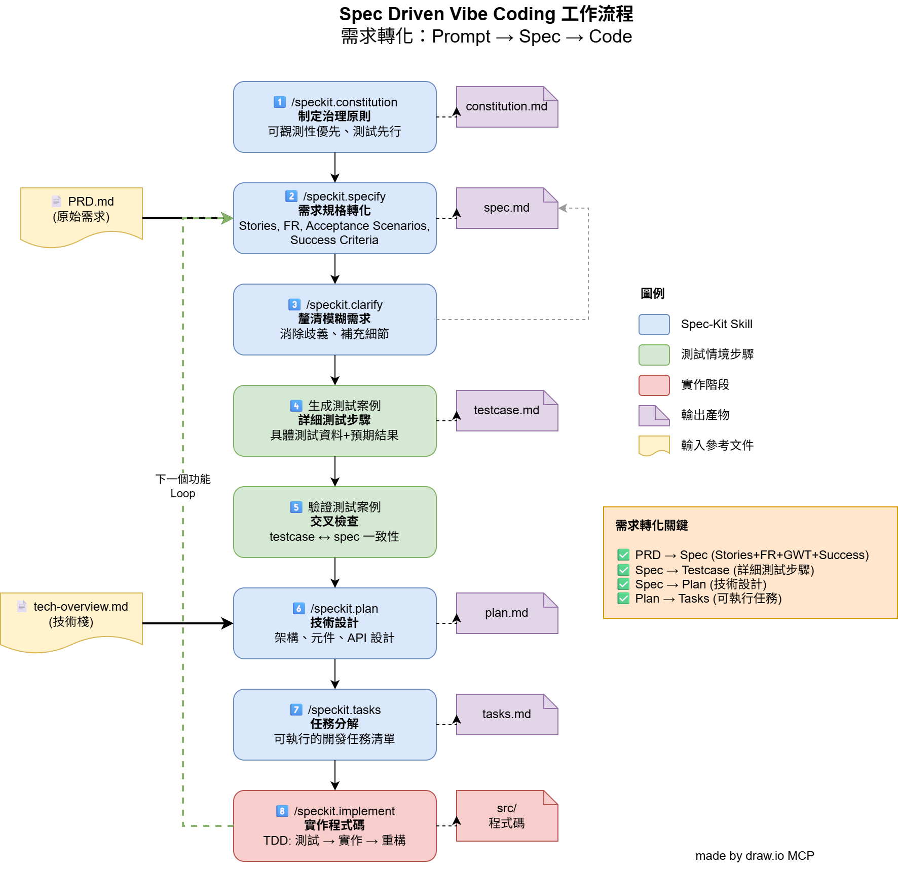

# TODO API - 具備可觀測性的待辦事項系統

一個展示可觀測性最佳實踐的 RESTful API 待辦事項管理系統。

> **注意**: 本專案採用 **Specification-Driven Development (SDD)** 方法論開發。
>


## 🎯 專案特色

- ✅ **完整的 CRUD 操作**: 建立、查詢、更新、刪除待辦事項
- 📊 **結構化日誌**: JSON 格式的結構化日誌，包含 request_id 追蹤
- 🔍 **請求追蹤**: 每個請求的唯一 request_id，支援分散式追蹤
- 📈 **Prometheus 指標**: 標準化的指標暴露（請求計數、延遲直方圖）
- 💚 **健康檢查**: 提供 /health 端點供監控系統使用
- 🧪 **測試驅動開發**: 73 個測試，98% 覆蓋率
- 🐳 **容器化部署**: Docker + Docker Compose 完整監控堆疊

## 🛠️ 技術堆疊

- **語言**: Python 3.11+
- **框架**: FastAPI 0.128+
- **伺服器**: Uvicorn (ASGI)
- **資料驗證**: Pydantic 2.0+
- **日誌**: Structlog (JSON 格式)
- **指標**: prometheus-client
- **測試**: Pytest + FastAPI TestClient
- **容器**: Docker + Docker Compose

## 🚀 快速開始

### 使用 Poetry (推薦本地開發)

```bash
# 1. 安裝依賴
poetry install

# 2. 執行測試
poetry run pytest

# 3. 啟動開發伺服器
poetry run uvicorn src.main:app --reload

# 4. 存取 API
curl http://localhost:8000
curl http://localhost:8000/health
curl http://localhost:8000/metrics

# 5. 存取 API 文件
open http://localhost:8000/docs  # Swagger UI
open http://localhost:8000/redoc # ReDoc
```

### 使用 Docker Compose (完整監控堆疊)

```bash
# 1. 啟動所有服務 (API + Prometheus + Grafana)
docker-compose up -d

# 2. 存取服務
# API: http://localhost:8000
# Prometheus: http://localhost:9090
# Grafana: http://localhost:3000 (admin/admin)

# 3. 查看 JSON 結構化日誌
docker logs todo-api -f

# 4. 停止服務
docker-compose down
```

### 📊 查看監控數據

#### Prometheus (http://localhost:9090)

在 Prometheus UI 的查詢框中輸入以下 PromQL 查詢：

```promql
# 每秒請求數 (QPS)
rate(http_requests_total[1m])

# P95 延遲
histogram_quantile(0.95, rate(http_request_duration_seconds_bucket[5m]))

# 總請求數（按端點分組）
sum by(method, path) (http_requests_total)

# 錯誤率
rate(http_requests_total{status=~"4xx|5xx"}[1m])
```

#### Grafana (http://localhost:3000)

1. 使用帳密登入: `admin` / `admin`
2. 存取 Dashboard：
   - **方法 1（直接連結）**: http://localhost:3000/d/todo-api-dashboard
   - **方法 2（手動導航）**: 點擊左側 "Dashboards" → 搜尋 "TODO API"
   - **方法 3（手動匯入）**: 左側 "+" → "Import" → 上傳 `docker/grafana-dashboard.json`
3. Dashboard 包含：
   - 每秒請求數 (QPS)
   - 總請求數
   - P95/P99 延遲
   - 端點狀態統計

**Prometheus 資料源**已自動配置，無需手動設定！

#### 查看 JSON 日誌

```bash
# 方法 1: 使用 docker logs 查看容器日誌
docker logs todo-api -f | grep -E '^{'

# 方法 2: 只看最新的 10 條 JSON 日誌
docker logs todo-api 2>&1 | grep -E '^{' | tail -10

# 方法 3: 格式化輸出
docker logs todo-api 2>&1 | grep -E '^{' | tail -1 | python3 -m json.tool
```

日誌欄位說明：
- `request_id`: 請求唯一識別碼
- `method`: HTTP 方法 (GET, POST, PUT, DELETE)
- `path`: API 路徑
- `status_code`: HTTP 狀態碼
- `latency_ms`: 請求處理延遲（毫秒）
- `timestamp`: ISO 8601 格式時間戳記

## 📖 API 端點

### 待辦事項管理

- `POST /todos` - 建立新的待辦事項
- `GET /todos` - 取得所有待辦事項清單
- `GET /todos/{id}` - 取得單一待辦事項
- `PUT /todos/{id}` - 更新待辦事項
- `DELETE /todos/{id}` - 刪除待辦事項

### 監控端點

- `GET /health` - 健康檢查
- `GET /metrics` - Prometheus 指標

### API 文件

- `GET /docs` - Swagger UI 互動式文件
- `GET /redoc` - ReDoc 文件

## 🧪 測試

```bash
# 執行所有測試
poetry run pytest

# 執行測試並顯示覆蓋率
poetry run pytest --cov=src --cov-report=html

# 執行特定類型的測試
poetry run pytest -m contract      # 契約測試
poetry run pytest -m integration   # 整合測試
poetry run pytest -m unit          # 單元測試

# 查看 HTML 覆蓋率報告
open htmlcov/index.html
```

**測試結果**: 73 個測試全部通過，98% 代碼覆蓋率 ✅

## 📊 可觀測性功能

### 結構化日誌

每個請求自動產生結構化 JSON 日誌:

```json
{
  "event": "request_completed",
  "request_id": "550e8400-e29b-41d4-a716-446655440000",
  "timestamp": "2026-01-17T18:00:00.000000Z",
  "method": "GET",
  "path": "/todos",
  "status_code": 200,
  "latency_ms": 12.34,
  "level": "info"
}
```

### Prometheus 指標

- `http_requests_total`: HTTP 請求總數（按 method, path, status 分組）
- `http_request_duration_seconds`: HTTP 請求延遲分布（直方圖）

指標設計遵循最佳實踐：
- ✅ 低基數標籤（避免 request_id, user_id 等）
- ✅ 路徑正規化（`/todos/123` → `/todos/{id}`）
- ✅ 標準化命名慣例

### 請求追蹤

- 自動為每個請求產生唯一的 `request_id` (UUID v4)
- 支援自訂 `X-Request-ID` 標頭
- request_id 同時出現在日誌與回應標頭中

## 📁 專案結構

```
todo-list/
├── src/                    # 原始碼
│   ├── api/               # API 路由器
│   │   ├── todos.py       # 待辦事項端點
│   │   ├── health.py      # 健康檢查
│   │   └── metrics.py     # 指標端點
│   ├── middleware/        # 中介軟體
│   │   ├── request_id.py  # Request ID 追蹤
│   │   ├── logging.py     # 結構化日誌
│   │   └── metrics.py     # Prometheus 指標收集
│   ├── models/            # Pydantic 模型
│   │   └── todo.py        # Todo 資料模型
│   ├── storage/           # 儲存層
│   │   └── memory.py      # 記憶體儲存實作
│   └── main.py            # FastAPI 應用程式入口
├── tests/                 # 測試
│   ├── contract/          # 契約測試 (API 端點)
│   ├── integration/       # 整合測試 (端到端)
│   └── unit/              # 單元測試 (模型、儲存)
├── docker/                # Docker 配置
│   └── prometheus.yml     # Prometheus 配置
├── Dockerfile             # Docker 映像檔
├── docker-compose.yml     # Docker Compose 配置
├── pyproject.toml         # Poetry 依賴管理
└── pytest.ini             # Pytest 配置
```

## 🎓 設計原則

本專案遵循以下設計原則（來自 `.specify/memory/constitution.md`）:

1. **可觀測性優先**: 結構化日誌、請求追蹤、指標暴露
2. **測試先行 (TDD)**: 先寫測試，確保紅燈→綠燈→重構
3. **契約與整合測試**: 每個 API 端點都有完整的契約測試
4. **微服務單一職責**: 清晰的服務邊界與責任劃分
5. **程式碼簡潔性**: YAGNI 原則，避免過度設計
6. **版本管理**: API 契約明確，避免破壞性變更

## 📈 效能指標

根據規格要求（`specs/001-todo-api/spec.md`）:

- ✅ **p95 延遲 < 100ms**: CRUD 操作
- ✅ **p99 健康檢查 < 10ms**: /health 端點
- ✅ **100% 日誌完整性**: 每個請求都有對應日誌
- ✅ **100% 追蹤準確率**: request_id 唯一且一致

## 🤝 開發流程

1. 閱讀規格: `specs/001-todo-api/spec.md`
2. 查看任務清單: `specs/001-todo-api/tasks.md`
3. 遵循 TDD 流程: 先寫測試（紅燈） → 實作功能（綠燈） → 重構
4. 確保測試通過: `poetry run pytest`
5. 檢查覆蓋率: `poetry run pytest --cov=src`


## 🔗 相關文件
### SDD 規格文件
- [功能規格](specs/001-todo-api/spec.md)
- [實作計畫](specs/001-todo-api/plan.md)
- [任務清單](specs/001-todo-api/tasks.md)
- [測試案例](specs/001-todo-api/testcase.md)
- [快速開始指南](specs/001-todo-api/quickstart.md)

### 架構圖表
- [SDD 開發流程圖](docs/spec-driven-flow.png)
- [人機協作除錯流程](docs/human-ai-fix-workflow.png)
